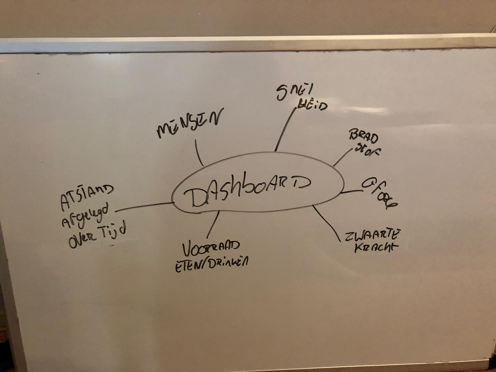
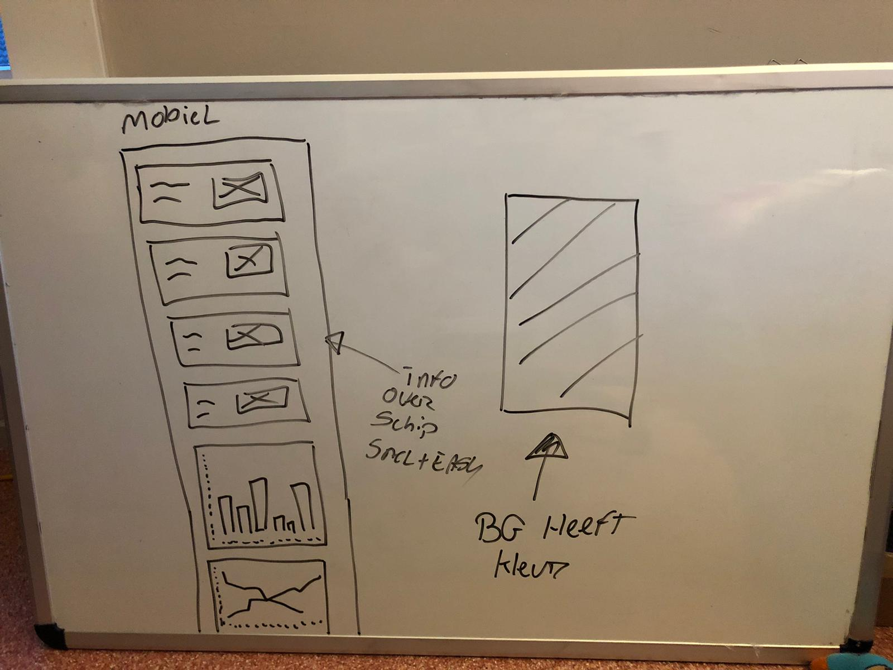
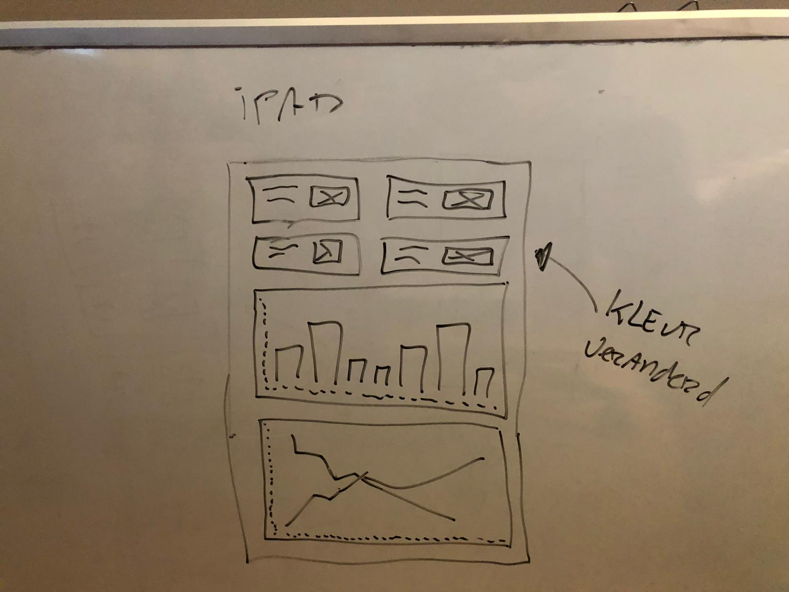
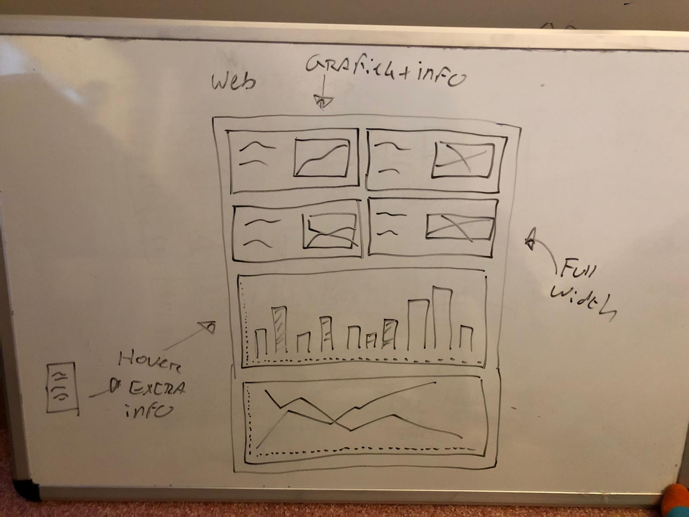
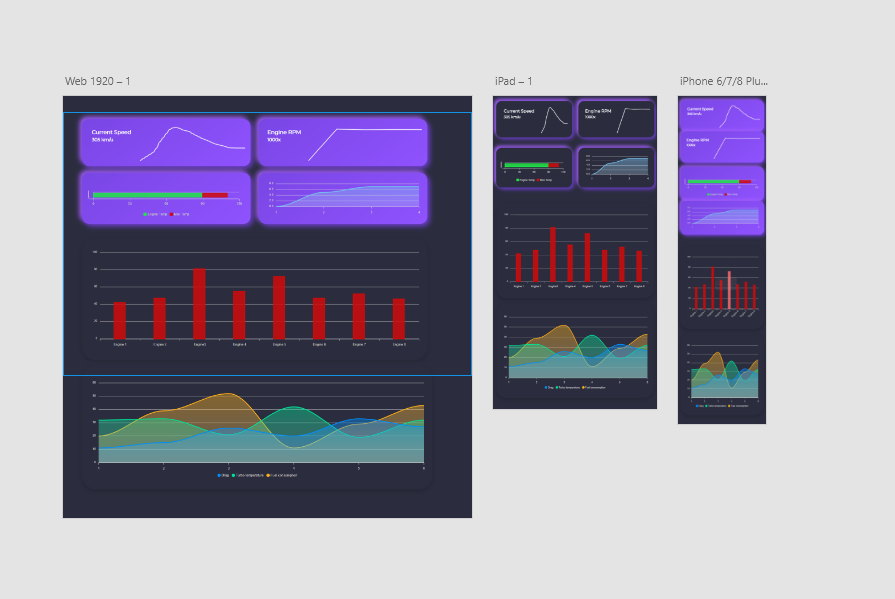

Schoolopdracht dashboard voor Elon Musk. De readme en de wiki zijn praktisch het zelfde op het moment. In de toekomst gaat de wiki dienen voor een roadmap en een tutorial voor het eventuele opzetten van dit project. Hieronder is alles te vinden over het project, het is ingedeeld in verschillende factoren en keuzes die ik heb gemaakt worden hier ingelicht / uitgelegd. De commits worden beschreven met wat er gedaan is en worden eerst op de development branch gezet om te kijken of alles werkt, als dit het geval is worden deze gepushd en gepullt op de master branch.

https://dinohier.github.io/NAS-Dashboard/

## Basic informatie dashboard

Het is 2030. 103 mensen betaalden $200.000 voor een kaartje om naar Mars te reizen en Elon Musk vroeg de Haagse Hogeschool om te helpen. De ITS is een prachtig ruimteschip, maar mist nog enkele van de noodzakelijke tools voor de reis. Men mist nog een overzicht om de data die deze reis verzameld wordt te tonen.

## Dasboard informatie
Kleine brainstorm sessie over de informatie die mij relevant lijkt en in het dashboard moet komen!

## Final schetsen ontwerp
De schetsen hoe het eind-ontwerp er uit moet komen te zien in grote lijnen.

## Uitgewerkt design 3 formaten
Het design uitgewerkt in drie formaten. Mobiel - Ipad - Desktop.

## Resources gebruikt
Icons SVG - https://linearicons.com/free
Charts -  https://apexcharts.com/
